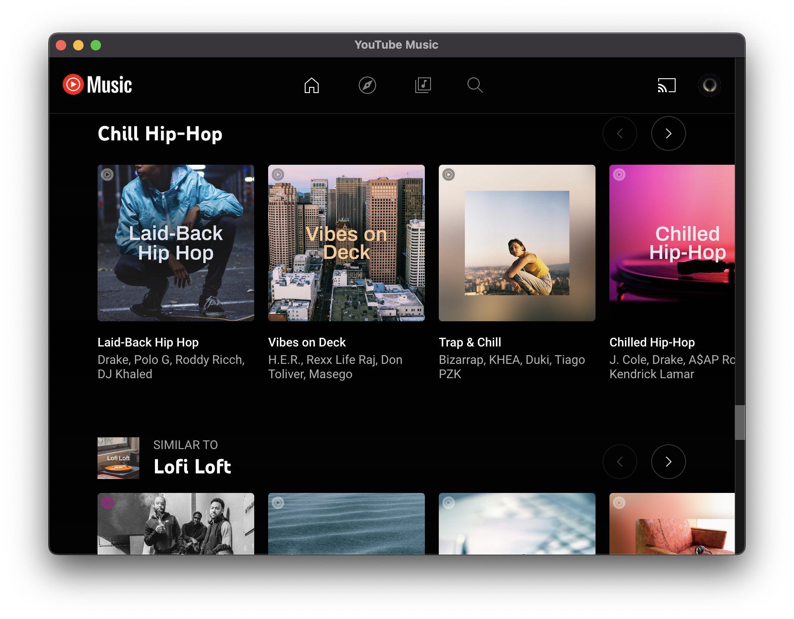

    
    <h1>Youtube Music</h1>

 
<h4 align="center">
  <a href="https://github.com/pauchiner/youtube-music/releases"> 🛠️ Installation </a>
  ·
  <a href="#-contributions"> 🧑‍🤝‍🧑 Contributions </a>
</h4>

> [!IMPORTANT]  
> This is not an official Youtube application, it is not intended to generate money nor am I responsible for its use.

# 🧑‍🤝‍🧑 Contributions

All contributions are welcome:

[CONTRIBUTING.md](https://github.com/pauchiner/youtube-music/blob/main/.github/CONTRIBUTING.md)

[CODE_OF_CONDUCT.md](https://github.com/pauchiner/youtube-music/blob/main/.github/CODE_OF_CONDUCT.md)

